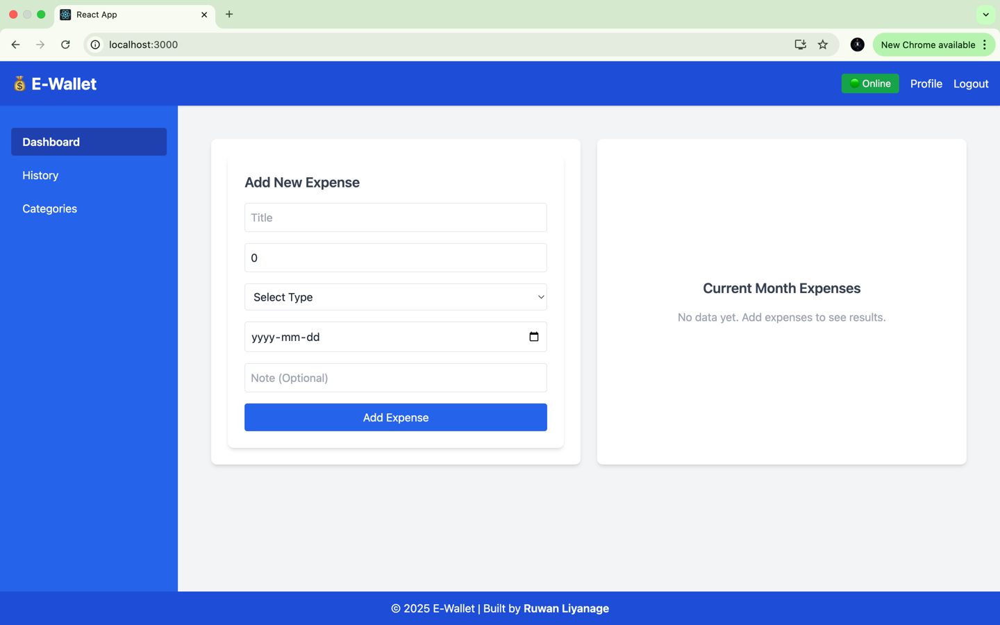
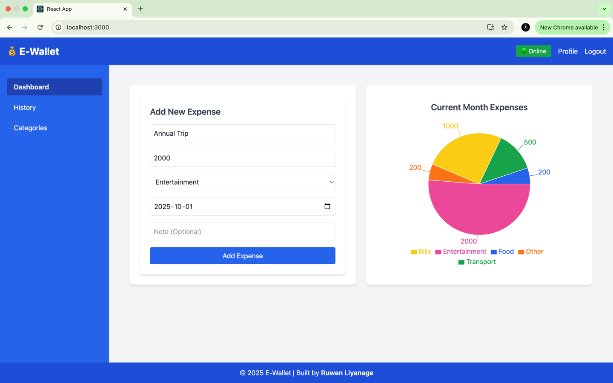
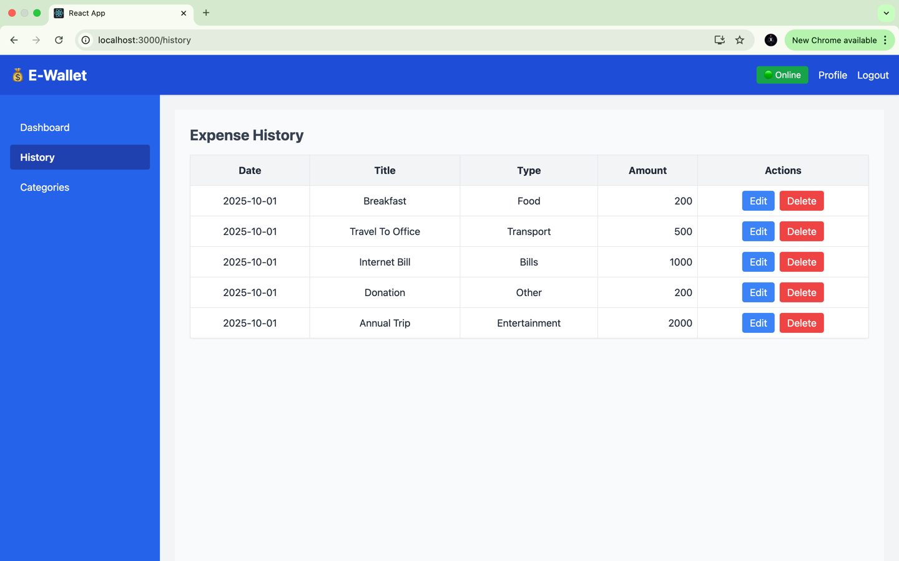
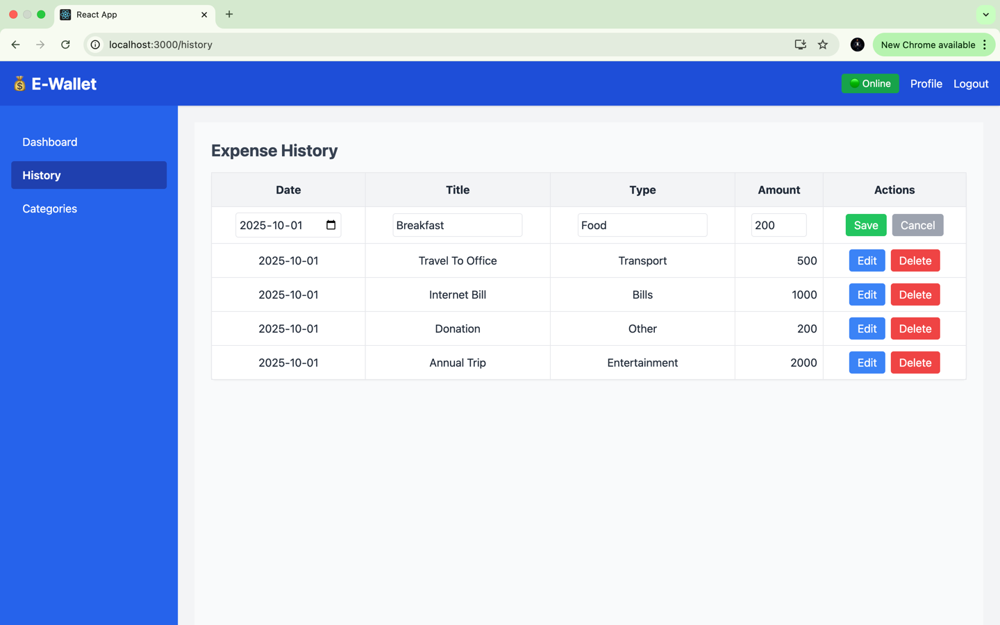
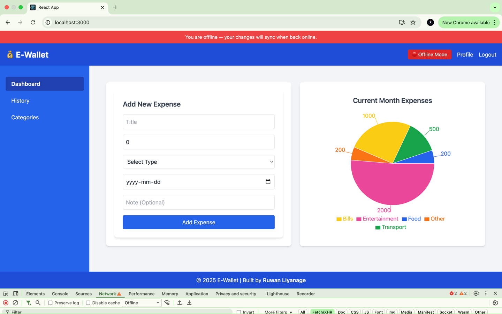

Dashboard View for Initial Setup with online/offline Indicator


Dashboard View for Ongoing Monitoring, Add Expenses


Feature Support for History Records


eature Support for Edit/Delete Expenses


Offline Support


Steps to Setup The Project

1. Clone the repository to your local machine.
```agsl
git clone https://github.com/ruwanliyanage123/expense-tracker.git
```
2. set up docker and docker compose in your local machine.
3. Navigate to the project directory.
```agsl
cd expense-tracker
```
4. start the docker compose container
```agsl
docker-compose up
```